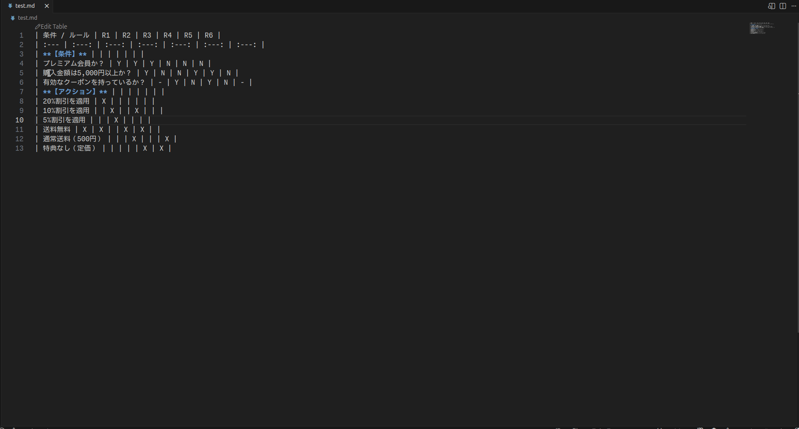

# Visual Table Canvas for Markdown

Edit Markdown tables with an Excel-like UI in VS Code.



## Features

- **Visual Table Editor**: Edit Markdown tables in a spreadsheet-like interface
- **Excel-like Operations**: Cell selection, copy/paste, undo/redo
- **Excel/Spreadsheet Integration**: Copy to/from Excel, Google Sheets (TSV format)
- **Keyboard Navigation**: Arrow keys, Tab, Enter, Ctrl+Arrow for data boundary jump
- **Row/Column Management**: Right-click to insert, delete, or insert copied rows/columns
- **Markdown Formatting**: Bold, italic, strikethrough, code, links are rendered
- **Auto Column Width**: Automatic column width adjustment with configurable max width
- **Freeze First Row**: Pin the first data row as a sticky header (toolbar checkbox)
- **Split or Same Tab**: Open editor beside or in the same tab (configurable)

## Usage

1. Open a Markdown file containing a table
2. Click "Edit Table" CodeLens above the table
3. Edit the table using the visual editor
4. Click "Save & Close" to save changes

## Keyboard Shortcuts

### Selection Mode

| Key | Action |
|-----|--------|
| Arrow Keys | Navigate cells |
| Ctrl+Arrow Keys | Jump to data boundary (Excel-like) |
| Tab | Move to next cell |
| Shift+Tab | Move to previous cell |
| Enter | Move to cell below |
| Delete / Backspace | Clear selected cells |
| Ctrl+Z | Undo |
| Ctrl+Y | Redo |
| Ctrl+C | Copy |
| Ctrl+V | Paste |
| **Ctrl++** | Insert row(s) above / column(s) left (header selected) |
| **Ctrl+-** | Delete selected row(s) / column(s) (header selected) |
| F2 / Double-click | Start editing cell |

### Mouse Operations

| Action | Result |
|--------|--------|
| Shift+Click (cell) | Extend selection to clicked cell |
| Shift+Click (row/column header) | Extend selection to clicked row/column |

### Edit Mode

| Key | Action |
|-----|--------|
| Enter / Tab | Confirm edit |
| Escape | Cancel edit |
| Alt+Enter / Shift+Enter | Insert line break (`<br>`) |
| Ctrl+B | Toggle bold (`**text**`) |
| Ctrl+I | Toggle italic (`*text*`) |
| Ctrl+5 | Toggle strikethrough (`~~text~~`) |
| Ctrl+Shift+C | Toggle code (`` `text` ``) |
| Ctrl+V | Paste as link if clipboard is URL |


## Copy & Paste Behavior

### Excel/Spreadsheet Integration

- **Copy cells to Excel**: Select cells → Ctrl+C → Paste in Excel/Google Sheets
- **Paste from Excel**: Copy cells in Excel/Google Sheets → Select cell → Ctrl+V
- **Line breaks**: `<br>` tags are converted to actual line breaks in Excel, and vice versa

### Cell Paste (Ctrl+V)

| Clipboard + Selection | Behavior |
|-----------------------|----------|
| Single cell copied + Multiple cells selected | Apply to all selected cells |
| Multiple cells copied + Single cell selected | Paste from starting point (overwrite) |
| Copied same size + Multiple cells selected | Paste as is |
| Copied different size + Multiple cells selected | Show error |

### Row/Column Paste (Ctrl+V)

| Clipboard + Selection | Behavior |
|-----------------------|----------|
| Single row/column copied + Multiple rows/columns selected | Apply to all selected |
| Multiple rows/columns copied + Single row/column selected | Paste from starting point (overwrite) |
| Copied same size + Multiple rows/columns selected | Paste as is |
| Copied different size + Multiple rows/columns selected | Show error |

## Context Menu (Right-click)

### Row Header

| Menu Item | Action |
|-----------|--------|
| Delete Row | Delete selected row(s) |
| Insert Row Above | Insert row(s) above (1-10) |
| Insert Row Below | Insert row(s) below (1-10) |
| Insert Copied Row(s) | Insert copied row(s) at current position |

### Column Header

| Menu Item | Action |
|-----------|--------|
| Delete Column | Delete selected column(s) |
| Insert Column Left | Insert column(s) to the left (1-10) |
| Insert Column Right | Insert column(s) to the right (1-10) |
| Insert Copied Column(s) | Insert copied column(s) at current position |

## Configuration

| Setting | Default | Description |
|---------|---------|-------------|
| `visualTableCanvas.openBeside` | `true` | Open editor in split view. Set to `false` to open in same tab. |
| `visualTableCanvas.defaultMaxColumnWidth` | `300` | Default max column width (px) for auto-fit. |

## Requirements

- VS Code 1.85.0 or later

## Development

```bash
# Install dependencies
npm install

# Compile
npm run compile

# Watch mode
npm run watch

# Run tests
npm run test:unit

# Run tests with coverage
npm run test:coverage
```

## License

MIT